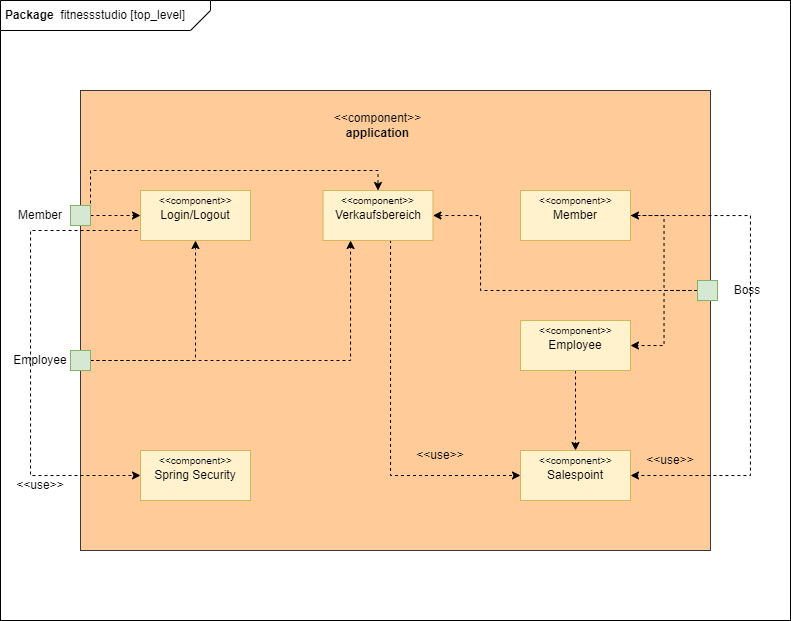
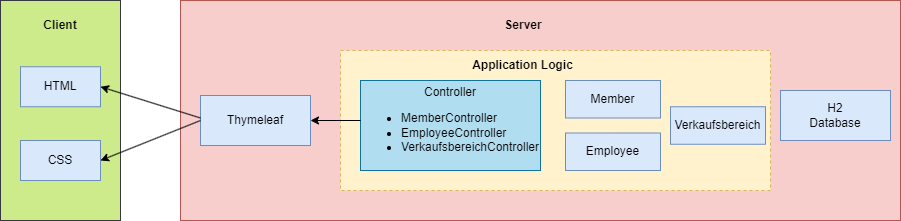
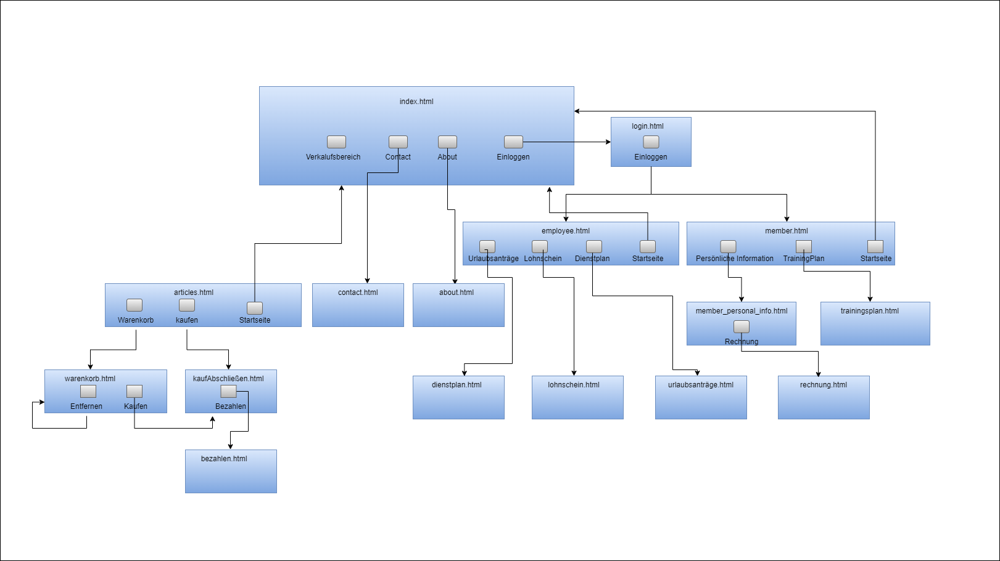
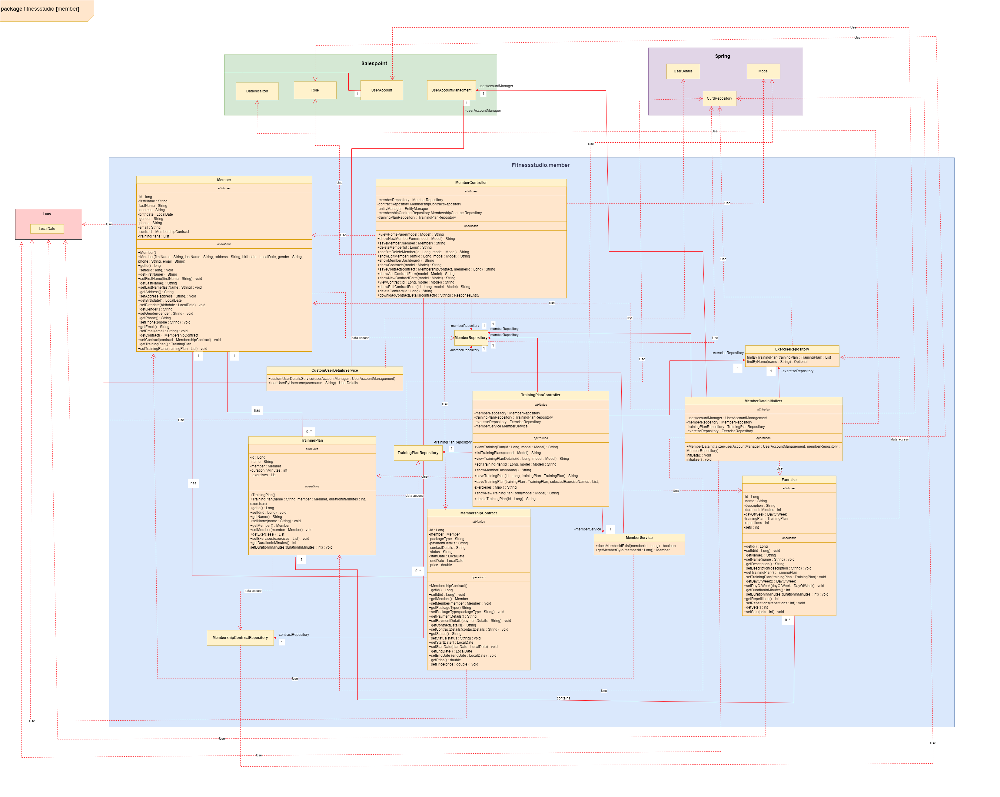
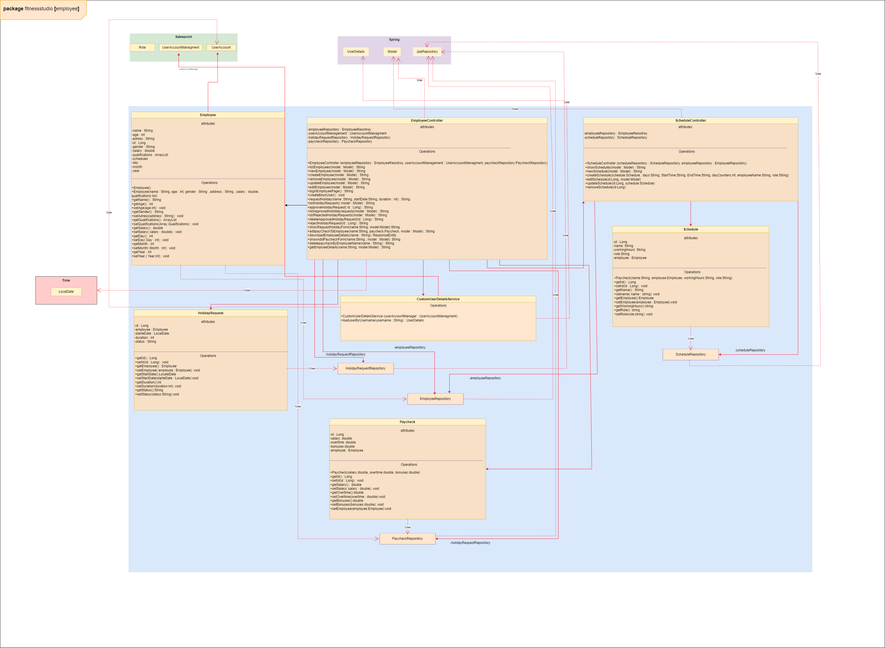
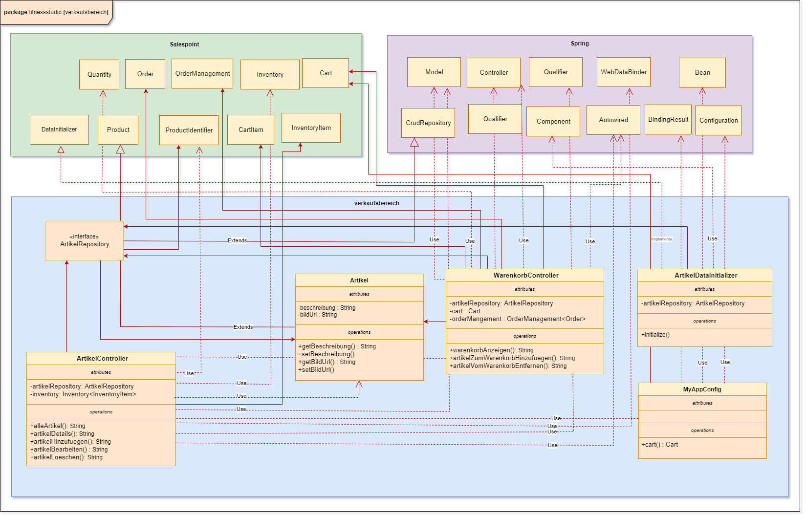

[options="header"]
[cols="1, 3, 3"]
|===
|Version | Bearbeitungsdatum   | Autor 
|1.0	| 28.05.2023 | Eyad Arbash
|1.0	| 28.05.2023 | Nazeeh Almasri
|1.0	| 28.05.2023 | Mohamad Rami Zien
|===

= Entwicklerdokumentation

== Einführung und Ziele
*Aufgabenstellung:*

Die Aufgabenstellung beinhaltet die Entwicklung einer umfassenden Softwarelösung für ein Fitnessstudio, die verschiedene Geschäftsfelder abdeckt und den Betrieb effizienter und benutzerfreundlicher gestaltet. 

Die wichtigsten Funktionen der Software sind:

* *Mitarbeiterverwaltung:* Die Software sollte es ermöglichen, Mitarbeiter des Fitnessstudios einzustellen, ihre Daten zu bearbeiten und sie gegebenenfalls zu entlassen. Die Mitarbeiterverwaltung sollte verschiedene Rollen, Aufgaben, Rechte und Gehälter abbilden können. Ein Dienstplan muss erstellt werden, der sicherstellt, dass immer ausreichend Personal anwesend ist. Lohnscheine sollen am Monatsende automatisch als PDF generiert werden, und Mitarbeiter sollten einen eigenen Login erhalten, um Zugang zu relevanten Informationen zu erhalten.

* *Mitgliederverwaltung:* Die Mitglieder des Fitnessstudios sollen ebenfalls verwaltet werden können, einschließlich ihrer Aufnahme, Bearbeitung und Beendigung der Mitgliedschaft. Mitglieder sollten einen Login erhalten, um auf ihre persönlichen Daten, Trainingspläne, Rechnungen und Terminvereinbarungen zugreifen zu können. Individuelle Trainingspläne sollen von Trainern erstellt und als PDF bereitgestellt werden können.

* *Eingangs- und Verkaufsbereich:* Mitglieder sollen sich beim Betreten und Verlassen des Fitnessstudios anmelden und abmelden können. An der Theke sollen Getränke, Nahrungsergänzungsmittel und Zubehör erworben werden können, die entweder bar bezahlt oder vom Kundenkonto abgebucht werden.

* *Artikelverwaltung:* Die Software sollte die Verwaltung von Verkaufsartikeln ermöglichen, einschließlich Hinzufügen, Bearbeiten und Löschen von Artikeln. Eine Nachbestellungsliste soll erstellt werden, wenn Artikel eine Mindestmenge unterschreiten. Verderbliche Artikel sollen ein Verfallsdatum haben, das bei jedem Programmstart überprüft wird. Rabatte sollen für ausgewählte Artikel und Zeiträume angelegt werden können.

*Qualitätsziele:*

Die Software sollte benutzerfreundlich sein und einen sicheren Zugriff für Mitarbeiter und Mitglieder ermöglichen. Sie sollte effizient und zuverlässig arbeiten und den Studioalltag erleichtern. Darüber hinaus sollten die verschiedenen Funktionen der Software leicht verständlich und anpassbar sein. 

* *Wartbarkeit:* Da die Fitnessstudio-Software verschiedene Funktionen abdecken und anpassbar sein sollte, ist die Wartbarkeit wichtig. Die Software sollte effektiv und effizient modifiziert werden können, um sie zu verbessern, zu korrigieren oder an Änderungen in der Umgebung und in den Anforderungen anzupassen.

* *Benutzerfreundlichkeit:* Die Benutzerfreundlichkeit ist sehr wichtig, da sowohl Mitarbeiter als auch Mitglieder des Fitnessstudios die Software nutzen werden. Die Software sollte leicht verständlich und einfach zu bedienen sein, um Effektivität, Effizienz und Zufriedenheit bei der Nutzung zu gewährleisten.

* *Sicherheit:* Die Sicherheit ist ebenfalls wichtig, da die Software persönliche Daten und Zugangsinformationen von Mitarbeitern und Mitgliedern verarbeitet. Die Software sollte sicherstellen, dass Informationen und Daten geschützt sind und nur autorisierten Personen oder Systemen Zugang gewährt wird.

[options="header"]
|===
|Qualitätsanspruch|1|2|3|4|5
|Wartbarkeit||||*X*|
|Benutzerfreundlichkeit|||||*X*
|Sicherheit||||*X*|
|===

== Randbedingungen

*Hardware-Vorgaben*

Eine Liste der erforderlichen Geräte / Hardware zum Ausführen und Verwenden der Anwendung.

- Server
- Computer
- Tastatur	
- Maus
- Drucker
- Barcode-Scanner
- Kartenlesegerät
- Zugangskontrollsystem
- Kameraüberwachungssystem
- Netzwerk-Hardware

*Software-Vorgaben*

Eine Liste der erforderlichen Software zum Ausführen und Verwenden der Anwendung.

Die folgende (oder neuere) Java-Version ist zum Ausführen der Anwendung erforderlich:

- Java 17

Zur Nutzung der Anwendung sind folgende (oder neuere) Browserversionen erforderlich:

- Internet Explorer/Edge 10.0
- Firefox 4.0
- Google Chrome 4.0
- Oper 9.6

*Vorgaben zum Betrieb des Software*

Dieser Abschnitt gibt einen Überblick darüber, wie das Produkt nach Fertigstellung verwendet werden soll und unter welchen Umständen.

Das System wird in einem Fitnessstudio eingesetzt, um verschiedene Geschäftsbereiche und Prozesse zu verwalten und zu optimieren. Die Software soll auf einem Server laufen und sowohl Mitarbeitern als auch Mitgliedern rund um die Uhr über das Internet (über einen Browser) zur Verfügung stehen.

Die primären Nutzer der Software sind Mitarbeiter des Fitnessstudios, die verschiedene Rollen und Aufgaben haben, sowie Mitglieder, die ihre Trainingspläne, Termine und persönlichen Daten verwalten möchten. Beide Gruppen von Nutzern sollten nicht unbedingt einen technischen Hintergrund haben müssen.

Das System muss wartbar und sicher sein, da die Mitarbeiter des Fitnessstudios bereits alle Hände voll zu tun haben. Alle Daten sollen persistent in einer Datenbank gespeichert und über die Anwendung zugänglich sein (z. B. sollten für einen Trainer oder Studioleiter keine SQL-Kenntnisse erforderlich sein).

== Lösungsstrategie
=== Erfüllung der Qualitätsziele
[options="header"]
|=== 
|Qualitätsziel |Lösungsansatz
|Wartbarkeit a| 
* *Modularität* Stellen Sie die Anwendung aus diskreten Komponenten zusammen, sodass Änderungen an einer Komponente weniger Auswirkungen auf andere Komponenten haben.

* *Wiederverwendbarkeit* Stellen Sie sicher, dass Komponenten des Systems von anderen Komponenten oder Systemen wiederverwendet werden können.

* *Modifizierbarkeit* Stellen Sie sicher, dass die Anwendung modifiziert oder erweitert werden kann, ohne Fehler einzuführen oder die Produktqualität zu verschlechtern.
|Benutzerfreundlichkeit a|* *Erlernbarkeit* Stellen Sie sicher, dass das System von seinen Benutzern leicht verwendet und verstanden werden kann. Dies kann z. eindeutige Beschreibung des Inhalts von Eingaben mit Labels oder Tooltips.

* *Benutzerfehlerschutz / Fehlerbehandlung* Schützen Sie den Benutzer vor Fehlern. Ungültige Eingaben dürfen nicht zu ungültigen Systemzuständen führen.

* *Ästhetik der Benutzeroberfläche* Bieten Sie dem Benutzer eine angenehme und zufriedenstellende Interaktion.

* *Zugänglichkeit* Stellen Sie sicher, dass Menschen mit unterschiedlichsten Eigenschaften das System vollständig nutzen können. Dies kann z. durch geeignete Schriftgrößen und Farbkontraste.

|Sicherheit a|* *Vertraulichkeit* Stellen Sie sicher, dass nur Personen auf Daten zugreifen können, die dazu berechtigt sind. Dies kann mit Spring Security und Thymeleaf (`sec:authorize` - tag) realisiert werden.

* *Integrität* Verhindern Sie die unbefugte Änderung von Daten. Dies kann mit Spring Security (`@PreAuthorize` - annotation) realisiert werden.

* *Verantwortlichkeit* Rückverfolgbarkeit von Handlungen oder Ereignissen zu einer eindeutigen Entität oder Person. Für diese Anwendung sollte jede Bestellung mit einem Kunden verknüpft werden.

|===

=== Softwarearchitektur

_Top Level Architecure of the application_

_Client-Server-Modell der Anwendung. Der Client enthält nur HTML- und CSS-Dateien. Die Anwendungslogik wird auf dem Server implementiert._

=== Entwurfsentscheidungen

* Verwendete Muster

- Spring MVC
* Persistenz

Die Anwendung verwendet eine auf Hibernate-Annotationen basierende Zuordnung, um Java-Klassen Datenbanktabellen zuzuordnen. Als Datenbank wird H2 verwendet. Die Persistenz ist standardmäßig deaktiviert. Um den Persistenzspeicher zu aktivieren, müssen die folgenden beiden Zeilen in der Datei application.properties auskommentiert werden:

....
# spring.datasource.url=jdbc:h2:./db/fitnessstudio
# spring.jpa.hibernate.ddl-auto=update
....

* Benutzeroberfläche

* Verwendung externer Frameworks

[options="header", cols="1,2"]
|===
|Externes Package |Verwendet von (Klasse der eigenen Anwendung)
|org.salespointframework.useraccount.UserAccountManagement	a| 
* CustomUserDetailsService
* MemberDataInitializer
* EmployeeController
* WarenkorbController
|org.springframework.security.core.userdetails.User		a| * CustomUserDetailsService
|jakarta.persistence.*	a| 
* Member
* MemberController
* Exercise
* TrainingPlan
* Employee
|org.springframework.format.annotation.DateTimeFormat	a| 
* Member
* MembershipContract
* Employee
|org.springframework.beans.factory.annotation.Autowired a|
* CustomUserDetailsService
* MemberController
* MemberService
* MemberDataIniatializer
* TrainingPlanController
* ArtikelController
* EmployeeController
* WarenkorbController
* ScheduleController
|org.springframework.ui.Model	a| 
* MemberController
* TrainingPlanController
* ArtikelController
* EmployeeController
* WarenkorbController
* ScheduleController
|org.springframework.data.repository.CrudRepository	a| 
* MemberRepository
* TrainingPlanRepository
* MembershipContractRepository
* ExerciseRepository
* EmployeeRepository
* ArtikelRepository
|org.springframework.beans.factory.annotation.Qualifier a| * ArtikelController
|org.springframework.context.annotation.Configuration a| 
* MyAppConfig
* ScheduleController
|org.springframework.validation.BindingResult a| * ArtikelController
|org.salespointframework.useraccount.Role	a| 
* MemberDataInitializer
* EmployeeController
|org.salespointframework.useraccount.Password	a| 
* MemberDataInitializer
* EmployeeController
|org.salespointframework.useraccount.UserAccount	a| 
* MemberDataInitializer
* EmployeeController
* WarenkorbController
|org.salespointframework.catalog.Product a| 
* Artikel
|org.salespointframework.catalog.Product.ProductIdentifier a| 
* ArtikelController
* WarenkorbController
* ArtikelRepository
|org.salespointframework.inventory.Inventory a| * ArtikelController
|org.salespointframework.inventory.InventoryItem a| * ArtikelController
|org.salespointframework.quantity.Metric a| * Artikel
|org.salespointframework.order.Cart a| 
* WarenkorbController
* MyAppConfig
|org.salespointframework.order.CartItem a| * WarenkorbController
|org.salespointframework.order.Order a| * WarenkorbController
|org.salespointframework.order.OrderMangement a| * WarenkorbController
|org.salespointframework.quantity.Quantity a| * WarenkorbController
|org.salespointframework.core.DataInitializer a|
* MemberDataInitializer
* ArtikelDataInitializer
|org.springframework.data.jpa.repository.JpaRepository a| 
* HolidayRequestRepository
* PaycheckRepository
|org.springframework.stereotype.Controller a|
* ScheduleController
|Org.springframework.security.core.authority.SimpleGrantedAuthority a|
* CustomUserDetailsService
|===

== Bausteinsicht
=== Member

[options="header"]
|=== 
|Klasse/Enumeration |Description
|MemberController |Ein Spring MVC-Controller, der die Anfragen zum Anzeigen, Hinzufügen, Bearbeiten und Löschen von Mitgliedern in der Anwendung verwaltet
|Member | Eine Klasse, die ein Mitglied repräsentiert und seine Eigenschaften wie Vorname, Nachname, Adresse, Geburtsdatum, Geschlecht, Telefon und E-Mail enthält. 
|MemberRepository |Ein Repository-Interface zur Verwaltung von Member-Instanzen, das CrudRepository erweitert.
|CustomUserDetailsService |Eine benutzerdefinierte Implementierung des UserDetailsService-Interfaces, die die Benutzerkontoverwaltung von Salespoint verwendet, um Benutzerdetails basierend auf ihrem Benutzernamen zu laden.
|MemberService | Diese Service-Klasse stellt Methoden zur Verfügung, um auf Mitgliederdaten zuzugreifen und sie zu manipulieren, z.B. um zu prüfen, ob eine bestimmte Mitglieder-ID existiert, oder um ein Mitglied anhand seiner ID zu holen.
|MemberDataInitializer| Diese Klasse ist für die Initialisierung der Daten im System verantwortlich. Sie enthält eine initialize Methode, die Benutzerkonten, Mitglieder, Trainingspläne und Übungen erstellt und in den jeweiligen Repositories speichert.
|Exercise| Diese Klasse repräsentiert eine Übung im Kontext eines Trainingsplans. Sie enthält Felder für Informationen wie den Namen der Übung, eine Beschreibung, die Dauer in Minuten, die Anzahl der Wiederholungen und Sätze sowie den Tag der Woche, an dem die Übung durchgeführt werden soll.
|ExerciseRepository| Dieses Interface erweitert das CrudRepository-Interface und ermöglicht die Durchführung von CRUD-Operationen (Erstellen, Lesen, Aktualisieren, Löschen) auf Übungsobjekten. Es beinhaltet auch Methoden zum Finden von Übungen nach Trainingsplan und Name.
|MembershipContract| Diese Klasse repräsentiert einen Mitgliedsvertrag. Sie hat Felder wie ID, PackageType, PaymentDetails, ContactDetails, Status, StartDate, EndDate, Price und eine Verbindung zu einer Member Instanz.
|MembershipContractRepository| Dieses Interface erweitert das CrudRepository-Interface und ermöglicht die Durchführung von CRUD-Operationen (Erstellen, Lesen, Aktualisieren, Löschen) auf Mitgliedsvertragsobjekten.
|TrainingPlan| Diese Klasse repräsentiert einen Trainingsplan, der zu einem Mitglied gehört. Sie hat Felder wie ID, Name, DurationInMinutes und eine Liste von Exercise Instanzen, die die Übungen des Trainingsplans darstellen.
|TrainingPlanRepository| Dieses Interface erweitert das CrudRepository-Interface und ermöglicht die Durchführung von CRUD-Operationen (Erstellen, Lesen, Aktualisieren, Löschen) auf Trainingsplanobjekten.
|TrainingPlanController| Diese Controller-Klasse stellt Endpunkte zur Verfügung, um Aktionen im Zusammenhang mit Trainingsplänen auszuführen, wie z.B. das Anzeigen, Erstellen, Bearbeiten und Löschen von Trainingsplänen.
|===

=== Employee

[options="header"]
|=== 
|Klasse/Enumeration |Description
|EmployeeController |Ein Controller für die Mitarbeiterverwaltung mit Endpunkten für Mitarbeiter, Urlaubsanfragen und Gehaltsabrechnungen
|Employee | Repräsentiert einen Mitarbeiter mit Eigenschaften wie Name, Alter, Geschlecht, Adresse, Qualifikationen und Gehalt. 
|EmployeeRepository |Schnittstelle für den Zugriff auf Mitarbeiterdaten in der Datenbank mit CRUD-Operationen und einer Methode zum Suchen von Mitarbeitern nach Namen.
|CustomUserDetailsService |Eine benutzerdefinierte Implementierung des UserDetailsService-Interfaces, die die Benutzerkontoverwaltung von Salespoint verwendet, um Benutzerdetails basierend auf ihrem Benutzernamen zu laden.
|HolidayRequestRepository |ist ein Interface für die Datenbankzugriffe auf Urlaubsanfragen. 
|HolidayRequest |repräsentiert eine Urlaubsanfrage eines Mitarbeiters mit Startdatum, Dauer und Status.
|Paycheck |repräsentiert eine Gehaltsabrechnung und enthält Informationen wie Gehalt, Überstunden und Boni.
|PaycheckRepository |ist ein Interface, das die Spring Data JPA Repository-Funktionalität implementiert. 
|Schedule |repräsentiert einen Arbeitsplan und enthält Informationen wie Name, Mitarbeiter, Arbeitszeiten und Rolle.
|ScheduleController |ist ein Controller für Arbeitspläne und enthält verschiedene Endpunkte zum Anzeigen, Erstellen und Aktualisieren von Arbeitsplänen.
|ScheduleRepository |ist ein Interface für die Datenbankzugriffe auf Arbeitspläne. 
|===

=== Verkaufsbereich

[options="header"]
|=== 
|Klasse/Enumeration |Description
|ArtikelController |Ein Spring MVC-Controller, der die Anfragen zum Anzeigen, Hinzufügen, Bearbeiten und Löschen von Artiklen in der Anwendung verwaltet
|Artikel | Ein Modell zur Darstellung eines Artikels im Fitnessstudio, welches von der Produktklasse aus dem Salespoint Framework erbt. Jeder Artikel hat einen Namen, eine Beschreibung, einen Preis und eine URL zu einem Bild.
|ArtikelRepository |Ein Interface, das das CrudRepository erweitert. Es ermöglicht CRUD-Operationen (Erstellen, Lesen, Aktualisieren, Löschen) auf Artikel-Objekten und definiert zusätzlich eine Methode zur Suche von Artikeln anhand ihres Namens.
|MyAppConfig|Eine Spring-Konfigurationsklasse, die den 'Cart' Bean zur Verwaltung von Bestellungen erstellt und zusätzliche Beans und Anwendungskonfigurationen bereit stellt.
|WarenkorbController|Ein Spring MVC Controller für die Verwaltung des Warenkorbs im Fitnessstudio. Dieser Controller ermöglicht das Hinzufügen von Artikeln zum Warenkorb, das Entfernen von Artikeln aus dem Warenkorb und das Anzeigen des aktuellen Warenkorbs. 
|ArtikelDataInitializer|Diese Klass lädt Initialdaten in die Fitnessstudio-Anwendung beim Start. Es erzeugt eine Reihe von Artikelobjekten mit vordefinierten Daten und speichert sie in der Datenbank mithilfe des ArtikelRepository. Die Initialisierung erfolgt nur, wenn die Datenbank leer ist, um eine mehrfache Einspeisung der gleichen Daten zu verhindern. 
|===

== Testplan

* *Unit-Tests:* Prüfen wir die kleinste Einheit des Codes einzeln. Beispiel: Funktionen und Methoden. Werkzeuge: JUnit.

* *Integrationstests:* Prüfen wir, wie verschiedene Teile des Codes zusammenarbeiten. Beispiel: Interaktion zwischen Controllern und Datenbanken. Werkzeug: Spring Boot Testframework.

* *Manuelle Tests:* Prüfen wir die Funktionalität und Benutzerfreundlichkeit des gesamten Systems aus Benutzersicht.

* *Cross-Tests:* Ein anderes Team testet das System, um eine andere Perspektive zu bekommen und möglicherweise übersehene Probleme zu identifizieren..