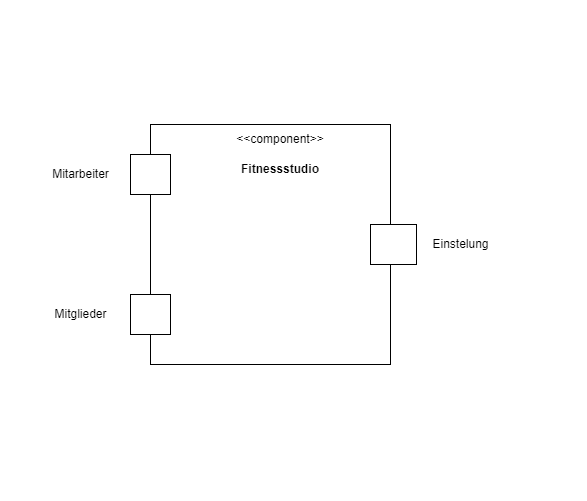
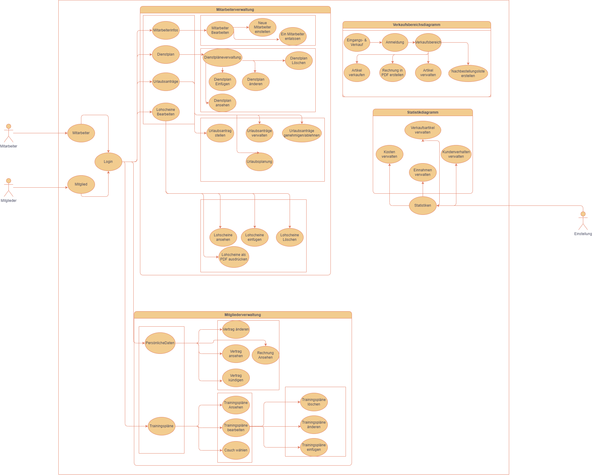
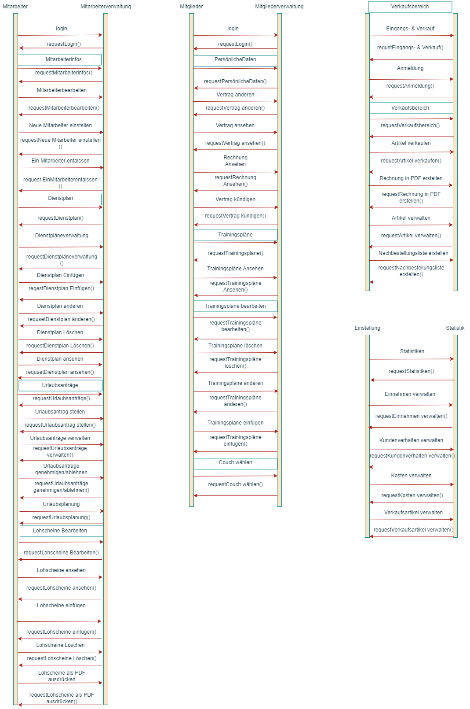
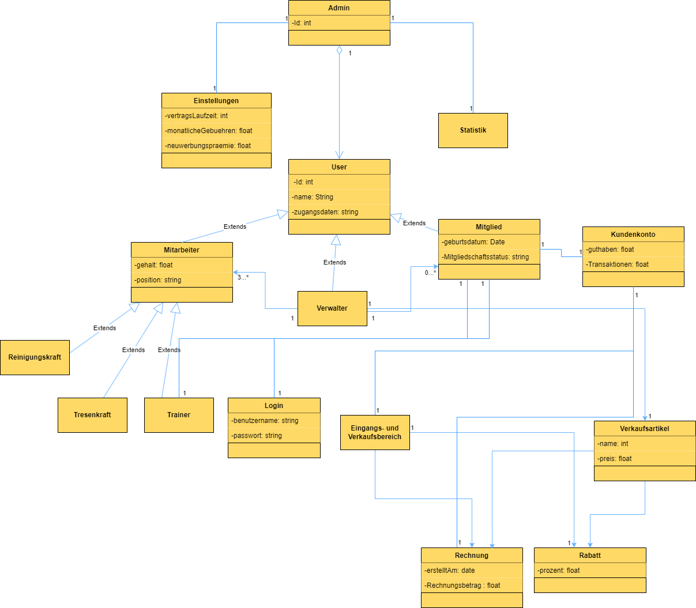

= Pflichtenheft
:project_name: Projektname
== __{project_name}__

[options="header"]
[cols="1, 1, 1, 4"]
|===
|Version | Status      | Bearbeitungsdatum   | Autoren(en) 
|1.0     | In Arbeit   | 15.04.2023          a| 
* Eyad Arbash
* Mohamad Rami Zien
* Nazeeh Almasri
|1.1| In Arbeit |10.06.2023 a|
* Eyad Arbash
* Mohamad Rami Zien
* Nazeeh Almasri      
|===

== Zusammenfassung
Dieses Dokument stellt die Pflichtenheft für das Projekt Fitnessstudio dar. Es zielt darauf ab, einen Überblick über das zu entwickelnde Softwareprodukt zu geben und dient als Grundlage für die Kommunikation zwischen den Stakeholdern des Projekts, hauptsächlich dem Kunden und dem Entwicklungsteam. Das Ziel ist, dieses Dokument als Grundlage für einen Vertrag zwischen dem Kunden und dem Auftragnehmer zu verwenden, und es sollte daher validiert und auf Konsistenz geprüft werden. Die Pflichtenheft beschreibt, was das gewünschte System erfüllen muss und teilweise, wie der Auftragnehmer beabsichtigt, die Lösung umzusetzen.

Im Allgemeinen sollte die Pflichtenheft korrekt, vollständig und konsistent sein. Da sie am Ende des Projekts verwendet wird, um zu überprüfen, ob die definierte Software geliefert wurde, sollte dieses Ziel überprüfbar sein. Sie wird während des gesamten Projekts verwendet und konsultiert, weshalb die Inhalte in allen erstellten Artefakten nachverfolgbar sein sollten. In Verbindung mit dem oben Genannten soll sie einfach zu ändern und zu entwickeln sein, obwohl Änderungen auf ein Minimum beschränkt sein sollten, nachdem sich die Stakeholder auf den Inhalt geeinigt haben. Da sich Anforderungen und Umstände während eines Projekts ständig ändern, sind Anpassungen zu erwarten und müssen dokumentiert werden.

== Aufgabenstellung und Zielsetzung
*Aufgabenstellung:*
Es soll eine umfassende Software für den Einsatz in einem Fitnessstudio entwickelt werden, die verschiedene Geschäftsfelder berücksichtigt und alle relevanten Prozesse digitalisiert und automatisiert. Die Software soll insbesondere die Mitarbeiter- und Mitgliederverwaltung sowie die Verwaltung von Angeboten und Kursen abdecken. Darüber hinaus soll die Software eine einfache und intuitive Benutzeroberfläche bieten, die sowohl für die Mitarbeiter als auch für die Mitglieder ansprechend und leicht zu bedienen ist.

*Mitarbeiterverwaltung:*
Die Software soll eine umfassende Mitarbeiterverwaltung ermöglichen, in der alle Angestellten des Fitnessstudios erfasst und verwaltet werden können. Dabei sollen verschiedene Mitarbeiterkategorien (z.B. Tresenkraft, Trainer, Reinigungskraft) berücksichtigt werden, die unterschiedliche Aufgaben und Rechte haben und unterschiedlich entlohnt werden. Die Software soll es ermöglichen, Dienstpläne zu erstellen und zu verwalten, um sicherzustellen, dass zu jeder Zeit ausreichend Mitarbeiter anwesend sind. Darüber hinaus sollen Lohnscheine für jeden Mitarbeiter automatisch am Ende des Monats als PDF generiert werden. Die Mitarbeiter sollen außerdem Zugang zu einem eigenen Login erhalten, über den sie ihren Dienstplan einsehen, den Lohnschein abrufen und Urlaubsanträge stellen können.

*Mitgliederverwaltung:*
Die Software soll eine umfassende Mitgliederverwaltung ermöglichen, in der alle Mitglieder des Fitnessstudios erfasst und verwaltet werden können. Dabei sollen verschiedene Mitgliedschaftsoptionen (z.B. Einzelmitgliedschaft, Familienmitgliedschaft, Studentenmitgliedschaft) berücksichtigt werden, die unterschiedliche Preise und Leistungen haben. Die Software soll es ermöglichen, Mitgliedschaften abzuschließen, zu verwalten und zu kündigen sowie Zahlungen automatisch abzuwickeln. Darüber hinaus sollen Mitglieder Zugang zu einem eigenen Login erhalten, über den sie ihre Mitgliedschaft verwalten und auf ihre Trainingsdaten zugreifen können.

*Verwaltung von Angeboten und Kursen:*
Die Software soll es ermöglichen, Angebote und Kurse des Fitnessstudios zu verwalten und zu planen. Dabei sollen verschiedene Kategorien (z.B. Fitnesskurse, Wellness-Angebote, Personal Training) berücksichtigt werden, die unterschiedliche Preise und Termine haben. Die Software soll es ermöglichen, Angebote und Kurse zu planen, zu verwalten und zu buchen sowie Teilnehmerlisten und Anwesenheitslisten zu erstellen.

*Zielsetzung:*
Das Ziel der Softwareentwicklung besteht darin, eine umfassende und benutzerfreundliche Software für den Einsatz in einem Fitnessstudio zu entwickeln, die alle relevanten Prozesse digitalisiert und automatisiert. Die Software soll es den Mitarbeitern ermöglichen, ihre Aufgaben effizienter und einfacher zu erledigen, und den Mitgliedern eine einfache und intuitive Möglichkeit bieten, ihre Mitgliedschaft zu verwalten und auf ihre Trainingsdaten zuzugreifen. Darüber hinaus soll die Software dazu beitragen, die Abläufe im Fitnessstudio zu optimieren und den Kundenservice zu verbessern.

== Produktnutzung
Dieser Abschnitt gibt einen Überblick darüber, wie das Fitnessstudio-Softwaresystem nach Fertigstellung verwendet werden soll und unter welchen Umständen.
Das System wird vom Fitnessstudio genutzt, um Mitglieder und Mitarbeiter zu verwalten sowie den Verkauf von Waren zu ermöglichen. Die Software soll auf einem Server laufen und rund um die Uhr über das Internet (über einen Browser) zur Verfügung stehen.
Das System soll für folgende Browser barrierefrei und optisch optimiert sein:
Mozilla Firefox, Version 92.0.1+
Google Chrome, Version 94.0.4606+
Die primären Nutzer der Software sind Mitarbeiter des Fitnessstudios, die vermeintlich typische Webseiten-Navigationsschemata kennen, sowie Administratoren (Manager), die nicht unbedingt einen technischen Hintergrund haben müssen.
Das System muss nicht technisch gewartet werden, da die Mitarbeiter des Fitnessstudios bereits alle Hände voll zu tun haben. Alle Daten sollen persistent in einer Datenbank gespeichert und über die Anwendung zugänglich sein (z. B. sollten für einen Manager keine SQL-Kenntnisse erforderlich sein).

Das Fitnessstudio-Softwaresystem umfasst folgende Funktionen:

*Mitarbeiterverwaltung:* Einstellung, Bearbeitung und Entlassung von Mitarbeitern, Dienstplanerstellung, Lohnschein-Erstellung, Login-System, Urlaubsanträge.

*Mitgliederverwaltung:* Aufnahme, Bearbeitung und Entlassung von Mitgliedern, Login-System, individuelle Trainingspläne, Betreuung von Probetrainings, Aussetzen von Mitgliedschaften.

*Eingangs- und Verkaufsbereich:* An- und Abmeldung von Mitgliedern, Verkauf von Getränken, Nahrungsergänzungsmitteln und Zubehör, Kundenkonto-System, Rechnungserstellung, Artikelverwaltung, Nachbestellungsliste, Verfallsdatum-Überwachung, Rabatt-System.

*Statistiken:* Laufende Kosten, Einnahmen, Kundenverhalten und Verkaufsartikel grafisch dargestellt.

*Einstellungen:* Vertragslaufzeit, monatliche Gebühren, Neuwerbungsprämie, Öffnungszeiten und andere Einstellungen können global verändert werden.

==  Stakeholder
Hier ist jede Gruppe oder Einzelperson (real oder juristisch) aufgelistet, die/den Einfluss auf die Anforderungen des Systems hat. In der folgenden Tabelle sind diese Interessengruppen aufgelistet, eine Priorität zugewiesen (falls Anforderungen kollidieren, ermöglicht dies einfachere Entscheidungen) und ihre übergeordneten Ziele beschrieben.
Die zugewiesenen Prioritäten reichen von 1 (niedrigste Priorität) bis 5 (höchste Priorität).

[options="header"]
|=======================
|Name|Priorität (1...5) |Beschreibung | Ziele
|Fitnessstudio-Betreiber    |5     |Der Hauptkunde des Projekts, der die Software nutzen und verwalten wird. |•	Verbesserung der Mitgliederverwaltung

• Vereinfachung der Buchhaltung

|Mitarbeiter    |4     |Personen, die im Fitnessstudio arbeiten und die Software verwenden werden.|•	Optimierung der Kommunikation mit den Mitgliedern

•	Schnellere Identifizierung von Problemen

|Mitglieder    |3     |Personen, die im Fitnessstudio trainieren und die Software verwenden werden.|•	Bessere Übersicht über die eigenen Fortschritte

•	Einfache Buchung von Kursen und Trainingszeiten

|Trainer    |3 |Personen, die im Fitnessstudio als Trainer arbeiten und die Software verwenden werden.|•	Einfache Verwaltung von Mitgliederdaten und Trainingsplänen

•	Bessere Kommunikation mit Mitgliedern und Kollegen
|Buchhalter|2|Personen, die für die Buchhaltung des Fitnessstudios verantwortlich sind.|•	Vereinfachte Erstellung von Rechnungen und Abrechnungen

•	Zuverlässige Überwachung von Zahlungen und Finanzströmen
|
|=======================

== Kontextdiagramm

Das Systemkontextdiagramm zeigt das geplante System in seiner Umgebung. Dies umfasst alle Nutzertypen, deren Zugriffsmöglichkeiten auf das System sowie Drittsysteme, die auf unser System zugreifen oder von diesem zugegriffen werden.

== Use-case

Dieser Abschnitt gibt einen Überblick über die Anwendungsfälle, die das System unterstützen muss. Diese Use Cases beschreiben, welche Funktionalität das System aus Kundensicht bereitstellen muss und welche Akteure daran beteiligt sind.

== Akteure

[options="header"]
|===
|Name| Beschreibung
|Mitarbeiter|Ein Angestellter des Unternehmens, der Zugriff auf die Mitarbeiterverwaltung und Lohnabrechnungen hat.
|Mitglieder|Eine Person, die Mitglied im Fitnessstudio ist und Zugriff auf die Mitgliederverwaltung und Trainingspläne hat.
|Einstellung|Ein Manager oder Administrator, der für die Verwaltung von Statistik verantwortlich ist.
|===
==  Use-case Diagramm

==  Sequenzdiagramm

== Funktionale Anforderungen

=== Muss-Kriterien
* *1 Mitarbeiterverwaltung*

- *1.1 Mitarbeiterinfos bearbeiten*

- 1.1.1 Neue Mitarbeiter einstellen

. Das System muss es dem Administrator ermöglichen, einen neuen Mitarbeiter anzulegen, indem er seine persönlichen Daten, Qualifikationen und Gehaltsinformationen eingibt.

- 1.1.2 Mitarbeiter entlassen

. Das System muss es dem Administrator ermöglichen, einen Mitarbeiter zu entfernen, indem er seinen Namen aus der Liste der Mitarbeiter auswählt.

- *1.2 Dienstplan verwalten*

- 1.2.1 Dienstplan löschen

. Das System muss es dem Administrator ermöglichen, einen bestehenden Dienstplan zu löschen, indem er den Namen des Plans auswählt.

- 1.2.2 Dienstplan einfügen
. Das System muss es dem Administrator ermöglichen, einen neuen Dienstplan zu erstellen, indem er den Namen des Plans und die Arbeitszeiten der Mitarbeiter eingibt.
. Das System muss sicherstellen, dass alle notwendigen Felder ausgefüllt sind, bevor ein neuer Dienstplan erstellt werden kann.

- 1.2.3 Dienstplan ändern

. Das System muss es dem Administrator ermöglichen, einen bestehenden Dienstplan zu ändern, indem er den Namen des Plans auswählt und die Arbeitszeiten der Mitarbeiter bearbeitet.

. Das System muss sicherstellen, dass alle Änderungen gespeichert werden, bevor der Administrator auf speichern drückt.

- *1.3 Urlaubsanträge verwalten*

- 1.3.1 Urlaubsantrag stellen

. Das System muss es dem Mitarbeiter ermöglichen, einen Urlaubsantrag zu stellen, indem er das gewünschte Datum und die Dauer des Urlaubs angibt.

- 1.3.2 Urlaubsanträge verwalten

. Das System muss es dem Administrator ermöglichen, alle Urlaubsanträge zu verwalten, indem er eine Liste aller offenen und genehmigten Anträge angezeigt bekommt.

. Das System muss sicherstellen, dass der Administrator Anträge genehmigen oder ablehnen kann.

- *1.4 Lohnscheine bearbeiten*

- 1.4.1 Lohnscheine einfügen

. Das System muss es dem Administrator ermöglichen, neue Lohnscheine für Mitarbeiter einzufügen, indem er die relevanten Informationen wie Gehalt, Überstunden, Bonuszahlungen usw. eingibt.

- 1.4.2 Lohnscheine als PDF ausdrucken

. Das System muss es dem Administrator ermöglichen, Lohnscheine als PDF-Datei herunterzuladen oder auszudrucken.

. Das System muss sicherstellen, dass die Lohnscheine nur für berechtigte Personen zugänglich sind.

- 1.4.3 Lohnscheine löschen

. Das System muss es dem Administrator ermöglichen, Lohnscheine zu löschen, indem er den Namen des Mitarbeiters und den entsprechenden Lohnschein auswählt.

* *2 Mitgliederverwaltung*

- *2.1 Mitgliederinfos bearbeiten*

- 2.1.1 Neue Mitglieder einstellen

. Das System muss es dem Administrator ermöglichen, einen neuen Mitglieder anzulegen, indem er seine persönlichen Daten, und  Mitgliedschaftsinformationen  eingibt. 
- 2.1.2 Mitglieder entlassen

. Das System muss es dem Administrator ermöglichen, einen Mitglieder zu entfernen, indem er seinen Namen aus der Liste der Mitglieder auswählt

- 2.1.3 Vertrag ändern

. Das System muss es dem Administrator ermöglichen, den Vertrag des Mitglieders zu ändern, indem er das gewünschte Paket auswählt und Änderungen an seinen Zahlungs- und Kontaktdaten vornimmt.

. Das System muss sicherstellen, dass der Mitgliedsvertrag automatisch aktualisiert wird, wenn Änderungen vorgenommen werden.

- 2.1.4 Vertrag ansehen

. Das System muss es dem Mitglied ermöglichen, seinen aktuellen Vertrag einzusehen, einschließlich der Kosten und der Leistungen, die im Vertrag enthalten sind.

- 2.1.5 Vertrag kündigen

. Das System muss es dem Mitglied ermöglichen, seinen Vertrag zu kündigen, indem es einen Kündigungsantrag stellt.

. Das System muss sicherstellen, dass das Mitglied eine Bestätigung über den Kündigungsstatus erhält.

- 2.1.6 Rechnungen ansehen

. Das System muss es dem Mitglied ermöglichen, seine Rechnungen einzusehen und als PDF herunterzuladen.

- *2.2 Trainingspläne verwalten*

- 2.2.1 Trainingspläne ansehen

. Das System muss es dem Mitglied ermöglichen, seinen aktuellen Trainingsplan einzusehen.
- 2.2.2 Trainingspläne bearbeiten

. Das System muss es dem Trainer ermöglichen, den Trainingsplan zu bearbeiten, indem er Übungen hinzufügt, entfernt oder ändert

. Das System muss sicherstellen, dass der aktualisierte Trainingsplan automatisch gespeichert wird und dem Mitglied zur Verfügung steht.

* *3 Verkaufsbereich*

- *3.1 Eingangs- & Verkauf*

- 3.1.1 Verkaufsbereich

. Das System muss es dem Kunden ermöglichen, Artikel auszuwählen und zu kaufen, indem er sie in den Warenkorb legt und den Kauf abschließt.

- 3.1.2 Nachbestellungsliste

. Das System muss es dem Administrator ermöglichen, eine Nachbestellungsliste von Artikeln zu erstellen, die aufgestockt werden müssen.

. Das System muss sicherstellen, dass der Administrator eine Benachrichtigung erhält, wenn Artikel auf der Nachbestellungsliste niedrig sind.

- 3.1.3 Artikel verwalten

. Das System muss es dem Administrator ermöglichen, Artikel hinzuzufügen, zu entfernen oder zu bearbeiten, indem er die relevanten Informationen wie Preis, Beschreibung und URL-Bilder eingeben kann.

. Das System muss sicherstellen, dass alle Artikel korrekt und vollständig angezeigt werden.

=== Kann-Kriterien

* *1 Statistik*

- 1.1 Kosten verwalten

. Das System muss es dem Administrator ermöglichen, alle Kosten zu verfolgen, die mit dem Betrieb des Unternehmens verbunden sind, einschließlich Gehälter, Miete, Versicherung, Energiekosten usw.

. Das System muss es dem Administrator ermöglichen, die Kosten nach Abteilungen oder Projekten aufzuschlüsseln und grafisch darzustellen.

- 1.2 Verkaufsartikel verwalten

. Das System muss es dem Administrator ermöglichen, den Verkauf von Artikeln zu verfolgen, einschließlich Umsatz, Gewinn und Verkaufszahlen.

. Das System muss es dem Administrator ermöglichen, die Verkaufsdaten nach Abteilungen, Artikeln oder Zeiträumen aufzuschlüsseln und grafisch darzustellen.

- 1.3 Einnahmen verwalten

. Das System muss es dem Administrator ermöglichen, alle Einnahmen zu verfolgen, die das Unternehmen erzielt, einschließlich Mitgliedsbeiträge, Verkaufserlöse, Kursgebühren usw.

== Nicht-Funktionale Anforderungen

=== Qualitätsziele

[options="header"]
|==========
|Qualitätsziele|Priorität
|Benutzerfreundlichkeit|Hoch
|Zuverlässigkeit|Hoch
|Leistung|Hoch
|Skalierbarkeit|Mittel
|Sicherheit|Mittel
|Wartbarkeit|Mittel
|Portabilität|Niedrig
|==========

=== Konkrete Nicht-Funktionale Anforderungen

*Benutzerfreundlichkeit:*

- Das System muss eine klare und intuitive Benutzeroberfläche bieten.

- Das System muss einfache Navigation ermöglichen.

*Zuverlässigkeit:*

- Das System muss stabil und zuverlässig sein.

- Das System muss Datensicherung gewährleisten.

*Leistung:*

- Das System muss schnelle Antwortzeiten bieten.

*Skalierbarkeit:*

- Das System muss anpassungsfähig für zukünftiges Wachstum sein.

*Sicherheit:*

- Das System muss Benutzerdaten schützen.

*Wartbarkeit:*

- Das System muss einfach aktualisiert und gewartet werden können.

*Portabilität:*

- Das System muss mit verschiedenen Plattformen kompatibel sein.

== GUI Prototyp

image::GUI_Prototype\1.png[width=750, height=810]
1- Startseite: Dies ist die Startseite der Anwendung. Sie enthält Produkte und zwei Felder. Es gibt auch einen Login-Button, der zur Login-Seite führt.

image::GUI_Prototype\2.png[width=750, height=810]
2- About-Seite: Wenn man auf den "About"-Button auf der Startseite klickt, gelangt man zu dieser Seite. Hier findet man Informationen über das Unternehmen und das Team.

image::GUI_Prototype\3.png[width=750, height=810]
3- Kontaktseite: Wenn man auf den "Contact"-Button auf der Startseite klickt, gelangt man zu dieser Seite. Hier kann man ein Formular ausfüllen, um das Unternehmen zu kontaktieren. Man muss seinen Namen, seine E-Mail und seine Nachricht angeben.

image::GUI_Prototype\4.png[width=750, height=810]
4- Verkaufsseite: Wenn man auf den "Verkaufsbereich"-Button auf der Startseite klickt, gelangt man zu dieser Seite. Hier findet man verschiedene Getränke, Lebensmittel und Zubehör zum Verkauf.

image::GUI_Prototype\5.png[width=750, height=810]
5- Login-Seite: Wenn man auf den "Login"-Button auf der Startseite klickt, gelangt man zu dieser Seite. Hier kann man sich als Mitglied oder Mitarbeiter anmelden.

image::GUI_Prototype\6.png[width=750, height=810]
6- Login-Informationen Seite: Wenn man auf den "Mitglied" oder "Mitarbeiter"-Button auf der Login-Seite klickt, gelangt man zu dieser Seite. Hier muss man seine E-Mail und sein Passwort eingeben, um sich anzumelden.

image::GUI_Prototype\7.png[width=750, height=810]
7- Mitgliederseite: Wenn man sich als Mitglied anmeldet, gelangt man zu dieser Seite. Hier kann man seine persönlichen Informationen, seinen Trainingsplan und seine Rechnungen einsehen. 

image::GUI_Prototype\8.png[width=750, height=810]
8- Persönliche Informationen Seite: Wenn man auf den "Persönliche Informationen"-Button auf der Mitgliederseite klickt, gelangt man zu dieser Seite. Hier kann man seine persönlichen Informationen wie Adresse, Geburtsdatum, Geburtsort, Telefonnummer und E-Mail einsehen und bearbeiten.

image::GUI_Prototype\9.png[width=750, height=810]
9- Trainingsplan Seite: Wenn man auf den "Trainingsplan"-Button auf der Mitgliederseite klickt, gelangt man zu dieser Seite. Hier kann man seinen wöchentlichen Trainingsplan einsehen.

image::GUI_Prototype\10.png[width=750, height=810]
10- Mitarbeiterseite: Wenn man sich als Mitarbeiter anmeldet, gelangt man zu dieser Seite. Hier kann man seinen Dienstplan, Gehaltsabrechnungen und Urlaubsanträge einsehen.

image::GUI_Prototype\11.png[width=750, height=810]
11- Dienstplan Seite: Wenn man auf den "Dienstplan"-Button auf der Mitarbeiterseite klickt, gelangt man zu dieser Seite. Hier kann man seinen wöchentlichen Dienstplan und den anderer Mitarbeiter einsehen.

== Datenmodell

=== Überblick: Klassendiagramm
UML-Analyseklassendiagramm

=== Klassen und Enumerationen
Dieser Abschnitt stellt eine Vereinigung von Glossar und der Beschreibung von Klassen/Enumerationen dar. Jede Klasse und Enumeration wird in Form eines Glossars textuell beschrieben. Zusätzlich werden eventuellen Konsistenz- und Formatierungsregeln aufgeführt.

// See http://asciidoctor.org/docs/user-manual/#tables
[options="header"]
|===
|Klasse/Enumeration |Beschreibung 
|Admin             |       Diese Klasse repräsentiert den Administrator der Fitnessstudio-Software, der für
die Verwaltung von Einstellungen und für die Verwaltung von Nutzern zuständig
ist.     
|Einstellungen|Diese Klasse enthält alle relevanten Einstellungen für das Fitnessstudio, wie zum
Beispiel Vertragslaufzeit, monatliche Gebühren, Neuwerbungsprämie und
Öffnungszeiten. Diese Einstellungen können vom Admin angepasst werden
|User|Diese Klasse repräsentiert einen Nutzer der Fitnessstudio-Software, der
entweder ein Mitarbeiter oder ein Mitglied des Fitnessstudios sein kann. Diese
Klasse enthält gemeinsame Eigenschaften und Methoden für Mitarbeiter und
Mitglieder.

|Statistik|Diese Klasse enthält Methoden und Eigenschaften zur Erfassung und
Auswertung von Daten und Statistiken, wie zum Beispiel laufende Kosten,
Einnahmen, Kundenverhalten und Verkaufsartikel.

|Mitarbeiter|Diese Klasse repräsentiert einen Mitarbeiter des Fitnessstudios und enthält
Eigenschaften wie Name, Adresse und Gehalt. Diese Klasse kann von der Klasse
Tresenkraft, Reinigungskraft und Trainer erweitert werden.

|Verwalter|Diese Klasse ist für die Verwaltung von Mitgliedern und Mitarbeitern zuständig
und enthält Methoden zur Einstellung, Entlassung und Bearbeitung von Nutzern.
|Mitglied|Diese Klasse repräsentiert ein Mitglied des Fitnessstudios und enthält
Eigenschaften wie Name, Adresse und Mitgliedschaftsstatus. Diese Klasse kann
von der Klasse Login und Trainer erweitert werden.
|Kundenkonto|Diese Klasse repräsentiert das Kundenkonto jedes Mitglieds und enthält
Eigenschaften wie Guthaben und Transaktionen. Diese Klasse kann von der
Klasse Verkaufsbereich und Rechnung erweitert werden.
|Reinigungskraft|Diese Klasse repräsentiert eine Reinigungskraft des Fitnessstudios und erbt
Eigenschaften und Methoden von der Klasse Mitarbeiter
|Tresenkraft|Diese Klasse repräsentiert eine Tresenkraft des Fitnessstudios und erbt
Eigenschaften und Methoden von der Klasse Mitarbeiter.
|Trainer|Diese Klasse repräsentiert einen Trainer des Fitnessstudios und erbt
Eigenschaften und Methoden von der Klasse Mitarbeiter. Diese Klasse kann
Trainingspläne für Mitglieder erstellen.
|Login|Diese Klasse repräsentiert den Login-Bereich der Fitnessstudio-Software und
enthält Methoden zur Überprüfung der Zugangsdaten und zur Authentifizierung
von Nutzern.

|Eingangs- und Verkaufsbereich| Diese Klasse repräsentiert den Bereich des Fitnessstudios, an dem Mitglieder
sich anmelden und wo Verkaufsgeschäfte getätigt werden. Diese Klasse enthält
Methoden zur Erfassung von Transaktionen und zur Verwaltung von
Verkaufsartikeln.
|Verkaufsartikel|Diese Klasse enthält Informationen zu den Verkaufsartikeln des Fitnessstudios,
wie zum Beispiel Name, Preis und Verfügbarkeit.
|Rechnung|Diese Klasse repräsentiert eine Rechnung für ein Mitglied oder eine Transaktion
und enthält Eigenschaften wie den Rechnungsbetrag und das Datum.
|Rabatt|Die Klasse enthält Informationen zu den Rabatten, die für bestimmte Artikel zu
einem bestimmten Zeitpunkt angeboten werden können. Sie ermöglicht die
Speicherung und Verwaltung von Rabattinformationen sowie die Überprüfung
des gültigen Zeitraums.
|===

